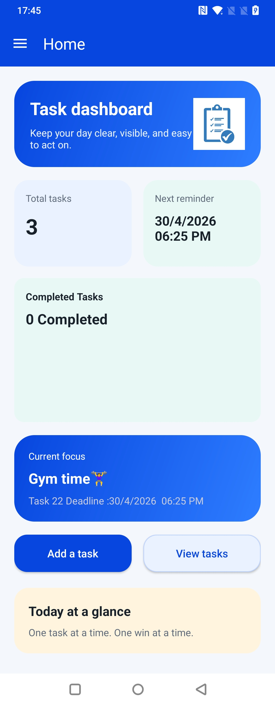
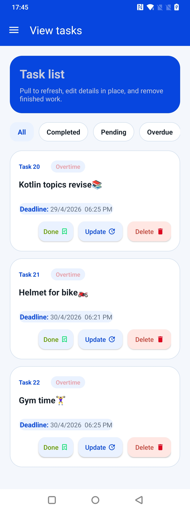

# 📋 TaskMaster

TaskMaster is a simple and efficient **task management Android application** designed to help users organize daily tasks, set priorities, manage deadlines, and track progress easily.

---

## ✨ Features

* ➕ Add new tasks quickly
* ✏️ Edit and update existing tasks
* 🗑️ Delete completed or unwanted tasks
* 🎯 Set task priorities
* 📅 Manage due dates and deadlines
* ✅ Track task completion status
* 🎨 Clean and user-friendly UI
* ⚡ Smooth and fast performance

---

## 🛠️ Built With

* Kotlin / Java
* Android Studio
* XML UI Design
* SQLite / Room Database
* Material Design Components

## 📱 Screenshots  

<p align="center">
  
  
  
</p>
## 📥 Download APK

👉 [⬇️ Download TaskMaster App](YOUR_APK_LINK_HERE)

> ⚠️ Enable "Install from Unknown Sources" before installing the APK

---

## 📱 Purpose

TaskMaster helps users improve productivity by keeping personal and professional tasks organized in one place.

---

## 🚀 Installation

1. Clone the repository

```bash
git clone https://github.com/Danishiqbal7819/TaskMaster.git
```

2. Open in Android Studio
3. Build & Run the project

---

## 🎯 Future Improvements

* 🔔 Task reminders & notifications
* ☁️ Cloud sync
* 🌙 Dark mode
* 📊 Task analytics

---

## 📧 Contact

👤 Danish Iqbal
📧 [iqbaldanish7819@gmail.com](mailto:iqbaldanish7819@gmail.com)

---

⭐ If you like this project, consider giving it a star!
